# ZHYC 快速开发平台

> 企业级低代码快速开发平台，面向后台管理、SaaS 租户、低代码建模、工作流审批、开放 API、移动办公和扩展能力的一体化基础框架。

> 品牌说明：ZHYC/zhyc 是众汇云创科技（深圳）有限公司“众汇云创”的缩写，作为平台名称、包名、配置前缀、权限编码和缓存 Key 前缀时保留原样，不翻译为其他中文或英文含义。

## 授权说明

本项目采用“源码开放非商用授权 + 商业授权”模式。源码公开仅用于个人学习、研究、测试、评估和其他非商业用途；未经众汇云创科技（深圳）有限公司书面授权，禁止用于任何商业用途。

禁止未授权商业使用的场景包括但不限于：企业生产环境部署、政企或外包项目交付、SaaS/云服务、二次开发销售、商业产品集成、为第三方提供有偿实施或运维服务。

授权文件：

- [LICENSE](LICENSE)：非商业用途授权条款，基于 PolyForm Noncommercial License 1.0.0。
- [COMMERCIAL-LICENSE.md](COMMERCIAL-LICENSE.md)：商业授权适用场景和申请方式。
- [NOTICE](NOTICE)：版权和项目声明。
- [TRADEMARKS.md](TRADEMARKS.md)：ZHYC、众汇云创和相关品牌标识使用规则。
- [THIRD-PARTY-NOTICES.md](THIRD-PARTY-NOTICES.md)：第三方依赖许可证摘要。

注意：由于本项目限制商业用途，因此不属于 OSI 定义下的开源许可证项目，更准确的表述是“源码可见 / Source-Available / 非商用免费”。

## 在线演示

可通过以下公开演示环境快速体验当前框架能力：

| 项目 | 内容 |
| --- | --- |
| 演示地址 | [https://base.zhyc-cloud.com/](https://base.zhyc-cloud.com/) |
| 演示账号 | `admin` |
| 演示密码 | `zhyc@123456` |

演示环境仅用于功能体验、界面预览和产品交流，数据可能按演示需要重置。请勿在演示环境录入真实业务数据、敏感信息、生产密钥或个人隐私数据。

## 项目介绍

ZHYC 快速开发平台不是单纯的后台管理模板，而是一套面向企业内部系统、行业 SaaS 平台和业务中台的快速开发底座。平台按本仓库的技术基线落地：核心平台采用模块化单体，认证中心和开放 API 网关独立部署，首期通过共享库共享表与 `tenant_id` 完成租户隔离。

平台当前重点能力：

- 在线数据源、数据表建模、字段建模和代码生成，支持从业务库加载物理表结构，也支持先建模型再生成数据库表。
- Spring Authorization Server 统一认证，核心平台内使用 Shiro 做菜单、按钮和数据权限。
- Flowable 工作流通过平台门面集成，业务模块不直接依赖 Flowable API。
- 开放 API 网关独立承担 API Key、签名、OAuth2 Token 校验、限流和审计。
- AI 能力中心统一接入大模型供应商、模型配置、AI 应用、提示词、知识库、会话审计和配额安全策略。
- 全文检索提供索引配置、重建任务和检索日志，可按业务模块初始化并逐步接入。
- 安全防护中心提供请求来源统计、接口访问排行、安全事件记录、阈值策略、IP/CIDR 封禁和运行时拦截。
- 登录保护已统一到认证中心，未登录或令牌失效访问受保护页面时直接跳转登录，不渲染后台业务内容。
- 后台管理端、移动端和后端模块分离，支撑 PC 管理、移动审批和开放平台集成。

## 技术架构

| 层级 | 技术栈 |
| --- | --- |
| 后端核心 | Java 21、Spring Boot 4.1、MyBatis、Apache Shiro 2.2.1、Redis Cache |
| 认证中心 | Spring Authorization Server、OAuth2、OIDC、JWK |
| 工作流 | Flowable 8，通过平台工作流门面接入 |
| 开放网关 | Spring Boot、API Key、签名校验、OAuth2 Token 校验、Redis 限流、防重放、审计 |
| AI 能力 | 多模型供应商、AI 应用、提示词、知识库、智能体、调用审计、配额与安全策略 |
| 数据库 | MySQL 首期深度支持，已生成 PostgreSQL、Oracle、SQL Server、达梦初始化脚本 |
| 后台前端 | Vue 3、Vite、TypeScript、Ant Design Vue、Pinia、Vue Router |
| 移动端 | uni-app，面向 H5、小程序和 App 端预留 |

## 工程结构

```text
.
├── db/                    # 汇总数据库初始化脚本和补丁脚本
├── docs/                  # 架构、规范、运行手册和 Agent 文档
├── zhyc-base-server/      # 后端多模块工程
├── zhyc-base-vue/         # 后台管理端
└── zhyc-base-uniapp/      # 移动端
```

后端模块：

```text
zhyc-base-server
├── zhyc-common            # 通用响应、异常、租户、模块注册等公共能力
├── zhyc-auth-server       # 统一认证中心
├── zhyc-openapi-gateway   # 开放 API 网关
├── zhyc-platform-app      # 核心平台启动入口
├── zhyc-module-system     # 系统、租户、组织、权限、审计、密钥中心
├── zhyc-module-lowcode    # 数据源、表模型、字段模型、页面模型、代码生成
├── zhyc-module-workflow   # 工作流门面、流程模型、任务和审批记录
├── zhyc-module-openapi    # 开放平台管理能力
├── zhyc-module-ai         # AI 能力中心、模型接入、AI 应用、提示词、知识库和调用审计
├── zhyc-module-purchase   # 采购样板业务
├── zhyc-module-message    # 消息中心
├── zhyc-module-file       # 文件中心
├── zhyc-module-job        # 在线作业
├── zhyc-module-cms        # 内容管理
├── zhyc-module-visual     # 报表和大屏
├── zhyc-module-i18n       # 国际化
└── zhyc-module-search     # 全文检索
```

## 功能清单

```text
├─工作台
│  ├─个人工作台
│  ├─流程待办
│  └─我的申请
├─系统管理
│  ├─租户管理、租户套餐、租户参数
│  ├─组织、岗位、用户、角色、菜单权限
│  ├─管理员范围、角色数据权限
│  ├─字典、参数、编码规则、模块管理
│  ├─登录日志、审计日志、异常日志、权限审计
│  └─密钥中心、密码策略、安全防护中心
├─低代码中心
│  ├─数据源管理
│  ├─数据表建模
│  ├─表关系建模
│  ├─页面模型
│  ├─生成模板
│  ├─代码生成
│  └─生成记录
├─工作流中心
│  ├─流程分类
│  ├─流程模型
│  ├─流程定义
│  ├─表单绑定
│  ├─待办、已办、发起、抄送
│  └─流程监控
├─开放平台
│  ├─开发者门户
│  ├─开放应用、API Key、OAuth2 客户端
│  ├─API 目录、版本、权限
│  ├─签名策略、限流策略
│  └─调用审计、错误日志
├─AI 能力中心
│  ├─AI 工作台
│  ├─模型供应商、模型配置
│  ├─AI 应用、提示词模板
│  ├─智能体、知识库、工具函数
│  ├─会话记录、调用审计
│  └─配额策略、安全策略
├─采购样板
│  ├─采购申请
│  ├─采购订单
│  └─采购审批记录
├─扩展能力
│  ├─消息中心
│  ├─文件中心
│  ├─在线作业
│  ├─内容管理
│  ├─报表大屏
│  ├─全文检索
│  └─国际化
└─移动端
   ├─移动工作台
   ├─流程待办
   ├─采购业务
   └─消息与个人中心
```

## 系统效果

### 个人工作台

工作台聚合待办、申请、开放 API 调用、代码生成记录和常用业务入口，是后台管理端的首屏入口。

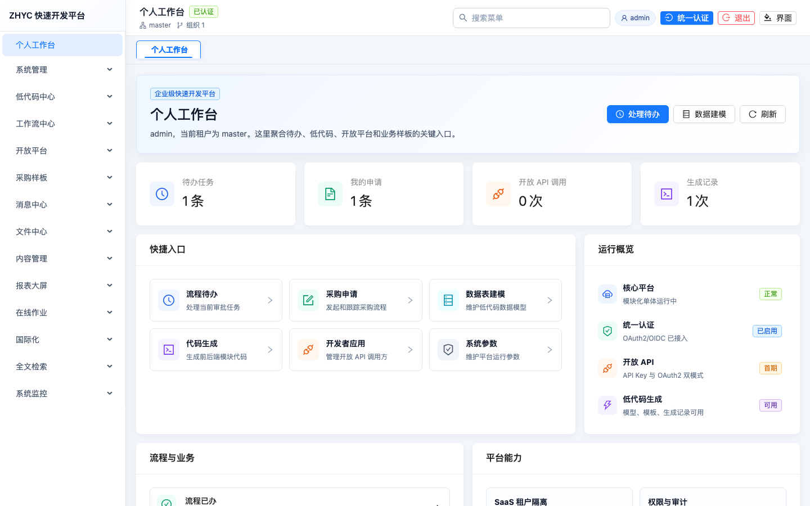

### 系统管理

系统管理覆盖租户、组织、用户、角色、菜单权限、审计日志、密钥中心、参数、字典和安全防护等后台基础能力。

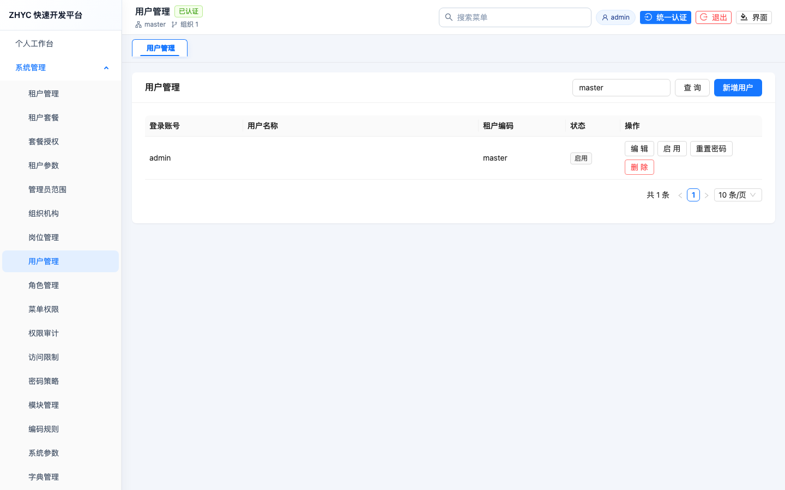

### 安全防护中心

安全防护中心位于系统管理下，统一承载安全看板、防护策略、访问限制规则和安全事件。页面提供今日请求来源、最高 IP 请求、违规 IP、封禁 IP、来源 IP 排行、接口访问排行、最近安全事件、核心阈值策略维护，以及 IP、账号、设备访问限制规则管理。手动封禁支持 IP、IPv6 和 IPv4 CIDR，并会同步到系统访问限制表；运行时过滤器命中有效封禁规则后返回 403。

配置开关：

```yaml
zhyc:
  security:
    protection:
      enabled: ${ZHYC_SECURITY_PROTECTION_ENABLED:true}
```

初始化脚本：

- `zhyc-module-system/src/main/resources/db/V5__system_security_protection.sql` 创建安全策略、安全事件、IP 封禁表并预置默认策略。
- `zhyc-module-system/src/main/resources/db/V2__system_seed.sql` 已保留“安全防护中心”一个菜单入口，并把访问限制查询、保存、校验权限挂在该菜单下。
- `zhyc-module-system/src/main/resources/db/V6__system_security_protection_menu.sql` 用于已经初始化过的现有数据库补齐并合并“安全防护中心”菜单和平台管理员角色授权。

### 低代码数据建模

数据表建模支持按数据源直接加载业务物理表，并过滤系统表、流程表、开放平台表、可视化表等内部表，例如 `sys_*`、`openapi_*`、`visual_*`、`wf_*` 和工作流引擎表。业务表可一键导入为低代码模型，也可以先新建模型后生成数据库表。

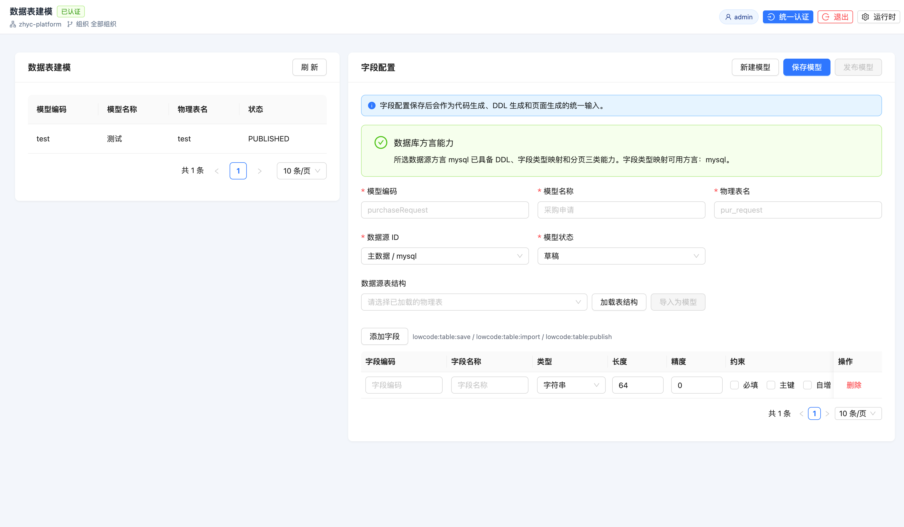

字段配置是代码生成、DDL 生成和页面生成的统一输入，支持字段类型、长度、精度、必填、主键和自增等元数据。

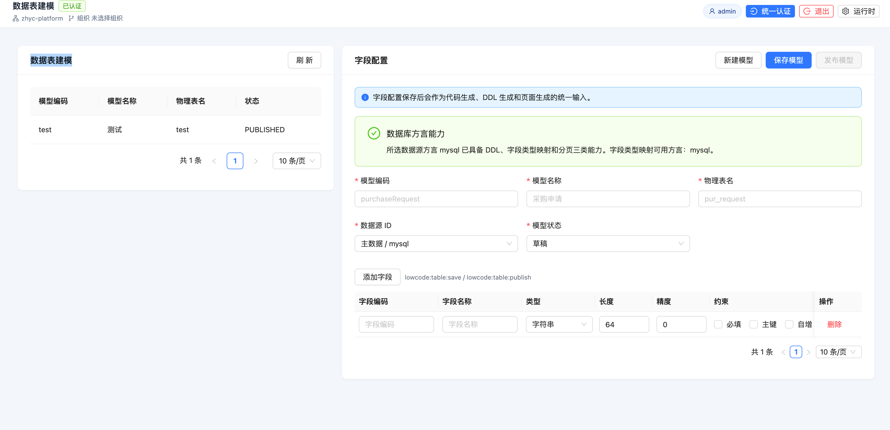

### 工作流中心

工作流中心提供流程分类、流程模型、表单绑定、流程定义、待办、已办、发起、抄送和监控等能力。

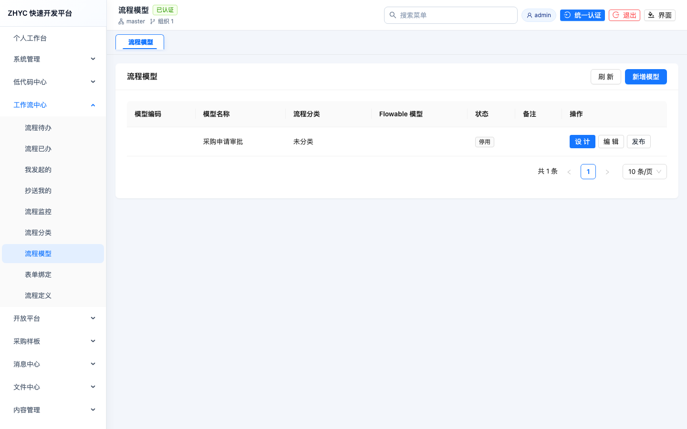

可视化流程设计器支持开始、审批、条件和结束节点编排，并提供节点属性配置。

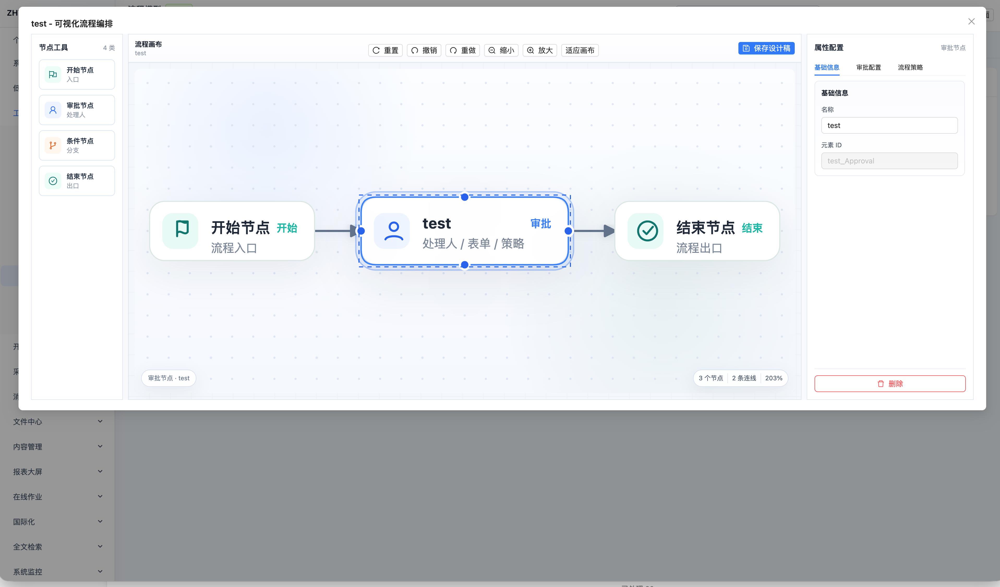

### 开放平台

开放平台面向第三方系统集成，提供开发者应用、API Key、OAuth2 客户端、API 目录、签名策略、限流策略和调用审计。

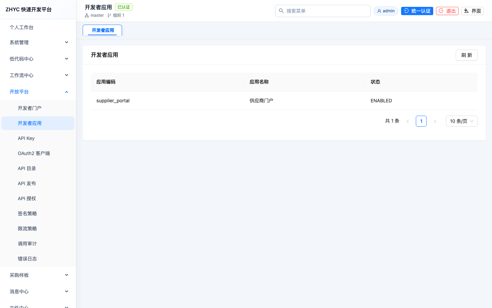

### AI 能力中心

AI 能力中心面向业务应用融合，统一管理模型供应商、模型配置、AI 应用、提示词模板、智能体、知识库、会话记录、调用审计、配额和安全策略。

当前后台已提供供应商、模型配置、应用接入、提示词和调用审计入口。供应商选择类型后会自动带出默认基础地址，仍允许按企业网关地址手动修改；密钥只通过密钥中心下拉选择 `secret:<secretCode>` 引用，不保存或展示明文。配置完成后可用“测试供应商”校验连通性，若返回 401，应优先检查 API Key、供应商类型、基础地址和模型侧权限。

推荐接入路径：

1. 在系统管理的密钥中心登记 API 密钥。
2. 在 AI 能力中心新增供应商，选择供应商类型、确认基础地址、绑定密钥引用并测试。
3. 在模型配置中绑定供应商和模型编码，启用流式输出或工具调用能力。
4. 创建 AI 应用，绑定默认模型、可用模型、提示词、配额和安全策略。
5. 业务页面、低代码、工作流和开放 API 只通过 AI 应用编码调用，不直接读取模型密钥。

### 采购样板

采购样板用于验证流程、业务表单、业务状态和审批记录联动，包含采购申请、采购订单和采购审批记录。

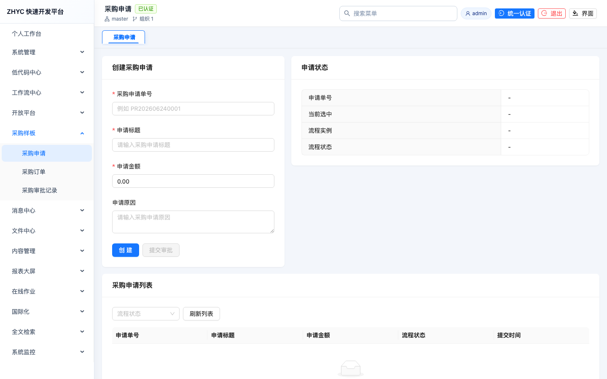

### 消息中心

消息中心提供站内消息、模板消息、已读未读状态和业务通知入口，支撑流程和系统事件提醒。

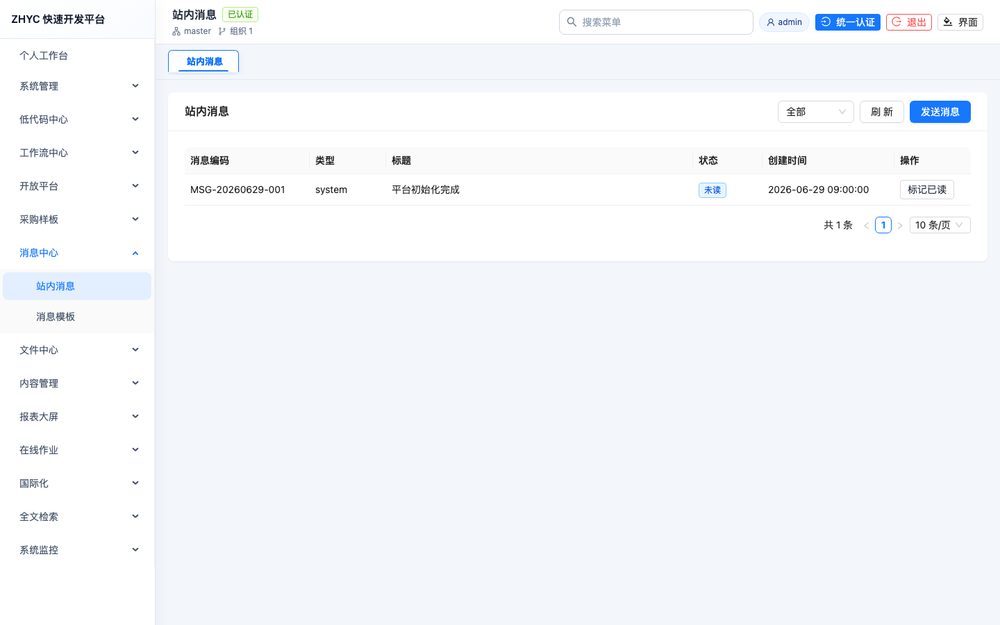

### 文件中心

文件中心覆盖存储配置、文件登记、文件上传、文件对象管理和预览日志，作为业务附件能力底座。

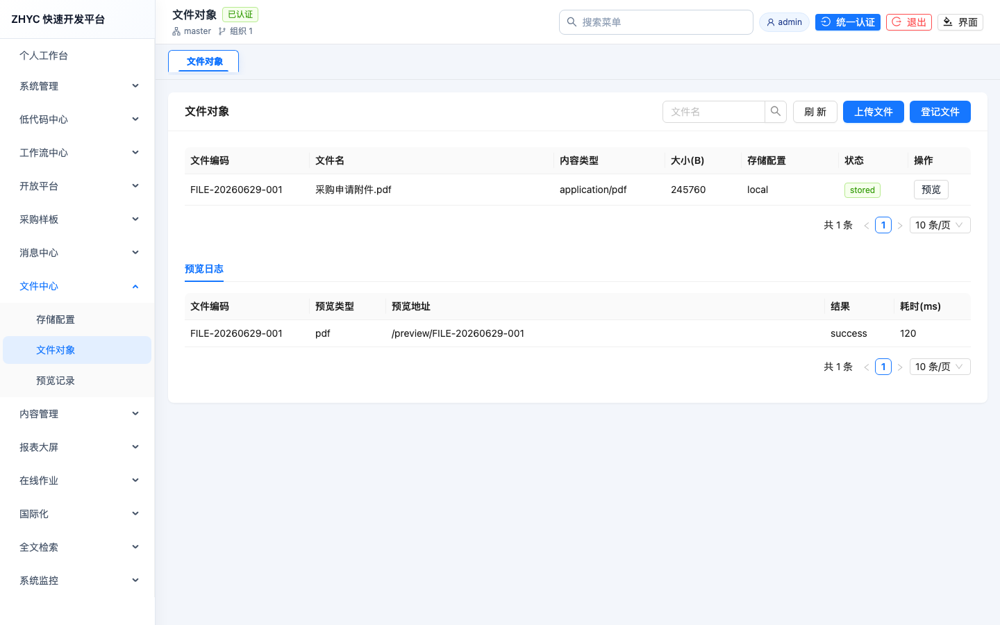

### 内容管理

内容管理提供栏目和文章维护能力，可用于平台公告、帮助文档和业务内容发布。

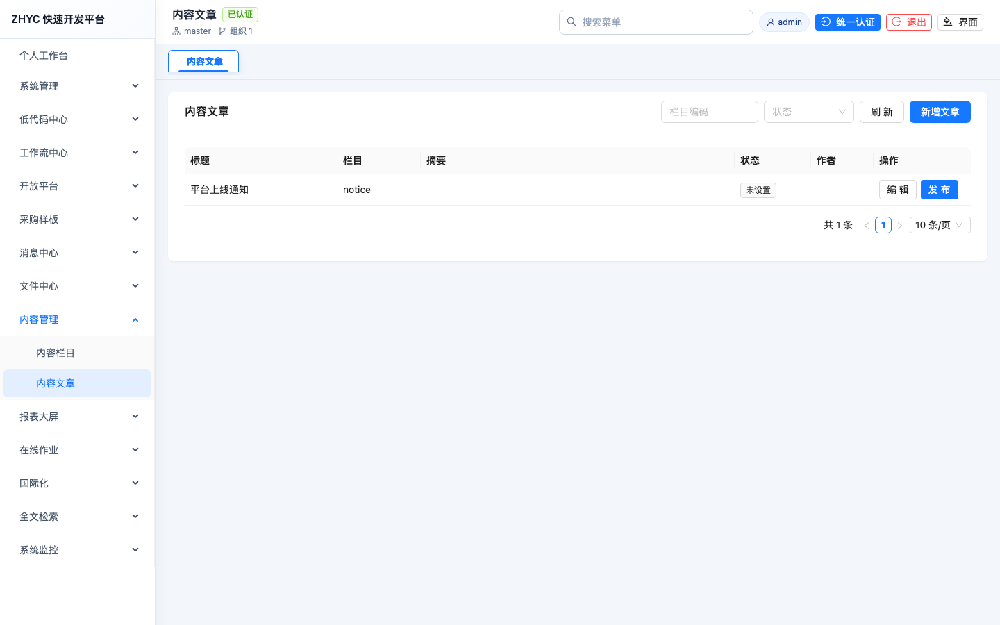

### 报表大屏

报表大屏提供数据集、报表设计器和可视化数据大屏管理能力，支撑数据展示和公开访问。

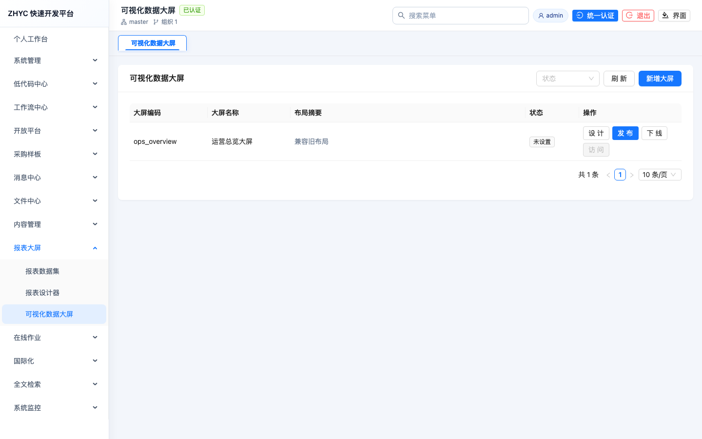

### 在线作业

在线作业用于维护定时任务、Cron 周期、任务启停、手动触发和执行日志。

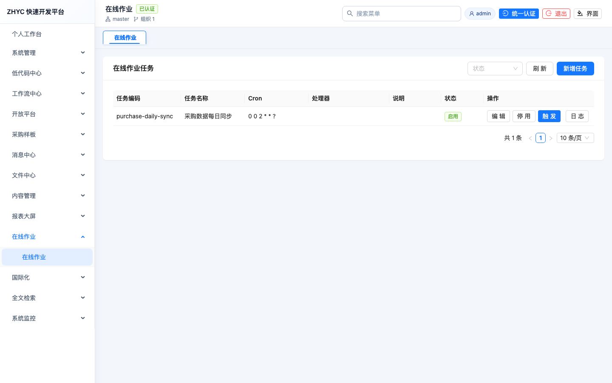

### 国际化

国际化用于维护多语言词条和本地化文案，为后续多语言后台、移动端和开放平台预留统一配置入口。

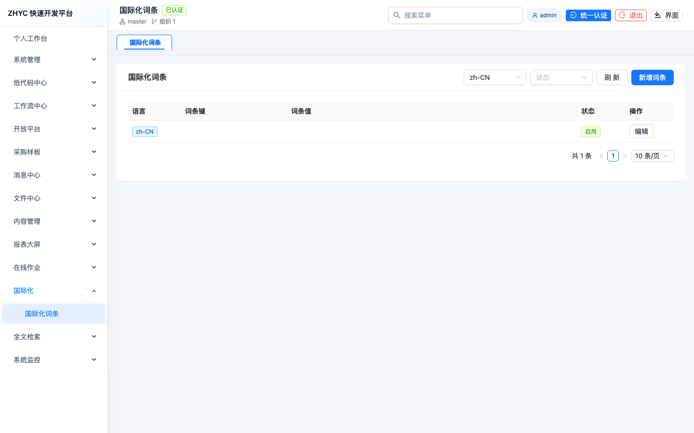

### 全文检索

全文检索支持配置业务索引、重建索引任务、执行检索和查看检索日志，便于业务数据统一搜索。

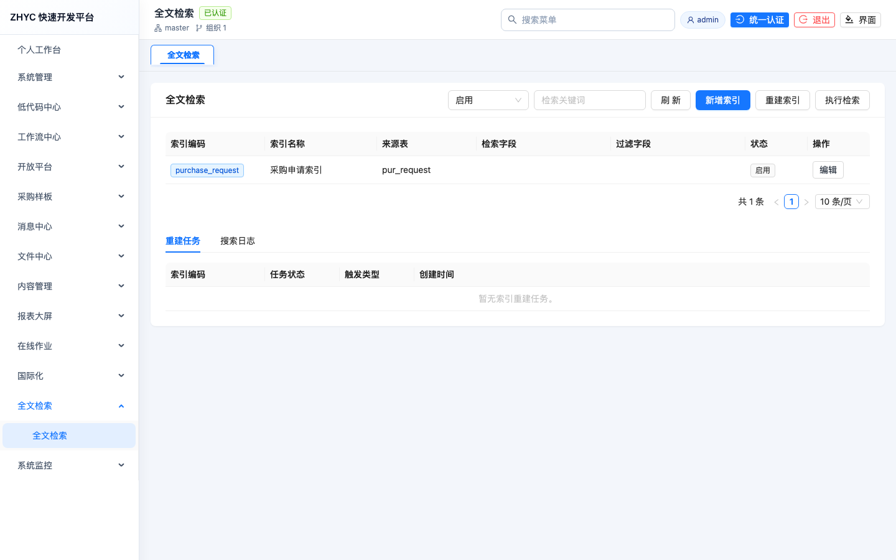

初始化脚本已包含全文检索基础表和菜单种子。接入业务表时先配置索引编码、来源表、主键字段、标题字段、内容字段和过滤字段，再执行重建任务；检索接口必须继续遵守租户和权限过滤。

### 系统监控

系统监控提供服务状态、数据源状态和 SQL 监控入口，用于快速查看平台运行健康度。

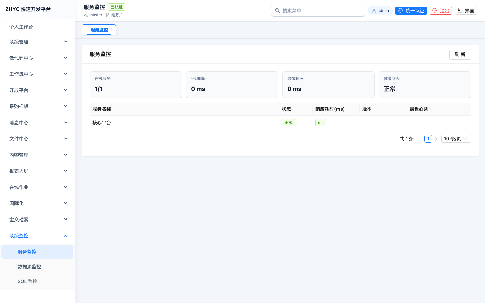

### 顶部菜单检索与统一入口

后台管理端提供菜单检索入口，可快速定位系统管理、低代码、工作流、开放平台等页面。


### 移动端规划

移动端面向移动办公场景，覆盖移动工作台、流程待办、采购业务、消息通知和个人中心；效果图后期随移动端版本计划更新。

## 本地启动

### 1. 准备环境

- JDK 21
- Node.js 20+
- MySQL 8+
- Redis 6+，本地默认 `127.0.0.1:6379` 且无密码
- Maven 3.9+

### 2. 两种运行方式

项目同时支持两种本地运行方式：

| 方式 | 适用场景 | 配置来源 |
| --- | --- | --- |
| 命令行方式 | 终端脚本、自动化验证 | `application-dev.yml`、`application-test.yml`、`application-prod.yml` |
| 启动类方式 | IntelliJ IDEA / Eclipse 直接运行 Spring Boot 启动类 | `spring.profiles.active=dev/test/prod` |

后端应用运行配置统一使用 Spring Boot profile：

- `dev`：本地开发环境，提供本机默认端口和本机地址占位。
- `test`：测试环境，必须通过环境变量、配置中心或发布系统注入真实值。
- `prod`：正式环境，只允许通过环境变量、配置中心或密钥管理系统注入真实值。

环境开关统一配置在各服务的 `application.yml`：

```yaml
spring:
  profiles:
    active: ${ZHYC_ENV:dev}
```

默认 `ZHYC_ENV=dev`，因此开发环境会自动加载 `application-dev.yml`；测试环境设置 `ZHYC_ENV=test` 加载 `application-test.yml`；正式环境设置 `ZHYC_ENV=prod` 加载 `application-prod.yml`。显式配置 `SPRING_PROFILES_ACTIVE`、`-Dspring.profiles.active` 或 `-Dspring-boot.run.profiles` 时，仍按 Spring Boot 原生优先级覆盖。

三类后端服务均提供 profile 配置：

- `application-dev.yml`
- `application-test.yml`
- `application-prod.yml`

真实数据库密码、OAuth2 client secret、JWK 私钥、AI Key 不得写入 Git；本机私有覆盖可使用已忽略的 `application-dev.local.yml`。

### 2.1 Redis 缓存配置

核心平台、认证中心和开放 API 网关均已接入 Redis。开发环境默认启用 Redis，本地无密码即可运行：

```bash
rtk redis-server
```

如本机 Redis 已作为系统服务运行，不需要重复启动。常用环境变量：

| 变量 | 默认值 | 说明 |
| --- | --- | --- |
| `ZHYC_REDIS_HOST` | `127.0.0.1` | Redis 地址 |
| `ZHYC_REDIS_PORT` | `6379` | Redis 端口 |
| `ZHYC_REDIS_PASSWORD` | 空 | 本地默认无密码 |
| `ZHYC_REDIS_DATABASE` | `0` | Redis 数据库序号 |
| `ZHYC_CACHE_ENABLED` | `true` | 核心平台 Spring Cache 开关 |
| `ZHYC_REDIS_ENABLED` | `true` | 开放 API 网关 Redis 限流和 nonce 开关 |
| `ZHYC_CACHE_PREFIX` | `zhyc` | Redis Key 前缀 |

当前缓存范围：

- 开放 API 网关：Redis 固定窗口限流、Redis nonce 防重放，Redis 异常时回退 JDBC。
- 核心平台：用户权限、菜单树、字典、系统参数、租户参数、AI 供应商、AI 模型、AI 应用和 AI 提示词列表缓存。
- 认证中心：接入 Spring Session Redis，为后续多实例统一登录态提供基础能力。

业务代码需要少量命令式缓存时，直接注入 `RedisBusinessCacheHelper`，Key 会统一生成为
`<ZHYC_CACHE_PREFIX>:biz:<cacheName>:<cacheKey>`，Redis 异常时 `getOrLoad` 会回退执行加载器：

```java
String cacheKey = redisBusinessCacheHelper.buildTenantKey(tenantId, requestId);
String detail = redisBusinessCacheHelper.getOrLoad(
    "purchase:detail",
    cacheKey,
    String.class,
    Duration.ofMinutes(5),
    () -> purchaseService.loadDetailJson(tenantId, requestId));
```

常用方法：

- `getOrLoad`：详情、低频查询、外部接口结果等“读不到再加载”的缓存。
- `getOrLoadOptional`：业务数据可能不存在，空结果不写 Redis。
- `refresh`：保存业务数据后强制重新加载并刷新缓存，加载为空时删除旧缓存。
- `multiGet` / `setAll`：批量读取和批量写入业务缓存，适合列表页提前补详情。
- `buildTenantKey`：拼接带租户维度的业务键，避免多租户缓存串数据。

约定：普通固定入口缓存优先使用 `@Cacheable`；临时详情、外部接口结果、低频查询结果可使用
`RedisBusinessCacheHelper`；分布式锁、队列、限流、nonce 防重放不要复用该帮助类。

### 2.6 公共帮助类

后端公共帮助类统一放在 `zhyc-common/src/main/java/com/zhyc/common/util`，业务模块不得重复定义同类工具方法。

| 帮助类 | 适用场景 |
| --- | --- |
| `TextHelper` | 必填文本校验、空白判断、裁剪归一化、禁止空白字符校验、尾缀归一化 |
| `CollectionHelper` | 集合和 Map 空值判断、null 集合转不可变空列表 |
| `SensitiveMaskHelper` | 手机号、邮箱、密钥、Token 等敏感值脱敏展示 |
| `IdHelper` | 标准 UUID、无横线 UUID、Base62 短随机串生成 |

约定：业务校验仍应保留在各模块 Service 或领域对象中；公共帮助类只封装无业务语义、可复用的基础能力。

### 3. 初始化数据库

数据库初始化同样读取 Spring Boot profile 配置，默认使用 `application-dev.yml`；测试和正式环境分别使用 `ZHYC_ENV=test`、`ZHYC_ENV=prod` 或 `--env test/prod`。脚本仍兼容 `--profile dev/test/prod`，旧 `--env-file` 仅保留为历史兼容入口。如需覆盖本机真实数据库账号，可通过环境变量或已忽略的 `application-dev.local.yml` 注入。

```bash
rtk node zhyc-base-server/scripts/phase1-db-initializer.mjs --profile dev --plan
rtk node zhyc-base-server/scripts/phase1-db-initializer.mjs --profile dev --check
rtk node zhyc-base-server/scripts/phase1-db-initializer.mjs --profile dev --emit-mysql
```

如需生成系统基础种子数据：

```bash
rtk node zhyc-base-server/scripts/phase1-seed-initializer.mjs --profile dev --plan
rtk node zhyc-base-server/scripts/phase1-seed-initializer.mjs --profile dev --materialize --output /tmp/zhyc-system-seed.local.sql
```

### 4. 启动认证中心

命令行方式：

```bash
rtk env JAVA_HOME=<JDK21_HOME> mvn \
  -f zhyc-base-server/pom.xml -pl zhyc-auth-server spring-boot:run \
  -Dspring-boot.run.profiles=dev
```

IDE 启动类方式：

```text
Main class: com.zhyc.auth.ZhycAuthServerApplication
Working directory: 项目根目录、zhyc-base-server 或 zhyc-auth-server 均可
VM options: -Dspring.profiles.active=dev
```

### 5. 启动核心平台

命令行方式：

```bash
rtk node zhyc-base-server/scripts/run-platform-local.mjs --profile dev
```

IDE 启动类方式：

```text
Main class: com.zhyc.platform.ZhycPlatformApplication
Working directory: 项目根目录、zhyc-base-server 或 zhyc-platform-app 均可
VM options: -Dspring.profiles.active=dev
```

### 6. 启动开放 API 网关

命令行方式：

```bash
rtk env JAVA_HOME=<JDK21_HOME> mvn \
  -f zhyc-base-server/pom.xml -pl zhyc-openapi-gateway spring-boot:run \
  -Dspring-boot.run.profiles=dev
```

IDE 启动类方式：

```text
Main class: com.zhyc.openapi.ZhycOpenApiGatewayApplication
Working directory: 项目根目录、zhyc-base-server 或 zhyc-openapi-gateway 均可
VM options: -Dspring.profiles.active=dev
```

### 7. 启动后台管理端

```bash
rtk npm --prefix zhyc-base-vue install
rtk npm --prefix zhyc-base-vue run dev
```

默认后台地址：

```text
http://127.0.0.1:5173
```

未登录访问后台、移动端受保护页面或 AI 能力中心页面时，会统一跳转登录页；登录成功后再回到原目标地址。

## 常用验证命令

```bash
# 低代码业务表加载和表模型元数据
rtk env JAVA_HOME=<JDK21_HOME> \
  mvn \
  -f zhyc-base-server/pom.xml -pl zhyc-module-lowcode -Dtest=DefaultLowcodeMetadataServiceTest test

# 后端全文检索模块
rtk env JAVA_HOME=<JDK21_HOME> \
  mvn \
  -f zhyc-base-server/pom.xml -pl zhyc-module-search -am test

# 认证中心
rtk env JAVA_HOME=<JDK21_HOME> \
  mvn \
  -f zhyc-base-server/pom.xml -pl zhyc-auth-server -am test

# 后台管理端
rtk npm --prefix zhyc-base-vue run typecheck
rtk npm --prefix zhyc-base-vue run build
rtk env ZHYC_ADMIN_VERIFY_USERNAME=<账号> ZHYC_ADMIN_VERIFY_PASSWORD=<密码> ZHYC_ADMIN_VERIFY_ACCOUNT_NAME=<账号显示名> npm --prefix zhyc-base-vue run verify:admin-cdp
rtk env ZHYC_ADMIN_VERIFY_USERNAME=<账号> ZHYC_ADMIN_VERIFY_PASSWORD=<密码> ZHYC_ADMIN_VERIFY_ACCOUNT_NAME=<账号显示名> npm --prefix zhyc-base-vue run verify:admin-interactions

# 移动端页面和未登录拦截
rtk env ZHYC_MOBILE_VERIFY_USERNAME=<账号> ZHYC_MOBILE_VERIFY_PASSWORD=<密码> ZHYC_MOBILE_VERIFY_ACCOUNT_NAME=<账号显示名> npm --prefix zhyc-base-uniapp run verify:mobile-cdp

# 首期初始化材料检查
rtk node zhyc-base-server/scripts/phase1-db-initializer.mjs --profile dev --check
rtk node zhyc-base-server/scripts/verify-search-phase1.mjs

# 安全防护中心和三级等保基础门禁
rtk env JAVA_HOME=<JDK21_HOME> \
  mvn \
  -f zhyc-base-server/pom.xml -pl zhyc-module-system,zhyc-platform-app -am \
  -Dtest=SysSecurityProtectionServiceTest,PlatformSecurityProtectionConfigTest test
rtk node zhyc-base-server/scripts/verify-security-phase1.mjs
```

## 后期计划

- 安全防护中心：补充自动封禁任务、租户级阈值模板、告警通知、黑白名单审批流、异常路径画像和等保报表导出。
- AI 能力中心：继续完善知识库、工具调用、智能体编排、调用成本分析、内容安全策略和业务页面快捷接入。
- 低代码中心：增强表关系建模、页面模型、移动端页面生成、业务规则编排和发布前差异检查。
- 工作流中心：完善流程实例监控、流程迁移、表单版本、委托代理、超时提醒和流程数据权限。
- 移动端：按移动办公场景逐步展示移动端效果图，补齐流程待办、消息、个人中心和业务表单体验。
- 运维与交付：增强 Redis 运行观测、数据库脚本版本比对、自动化初始化、灰度发布和回滚手册。

## 相关文档

- [本地运行手册](docs/release/phase1-local-runbook.md)
